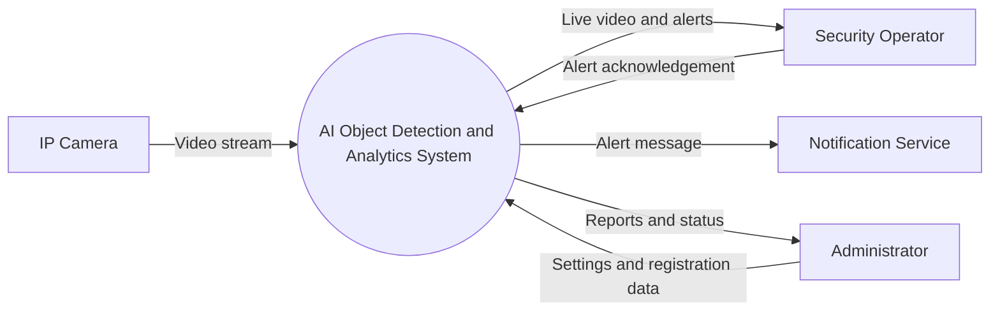
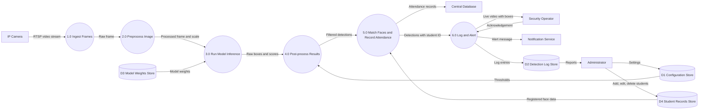
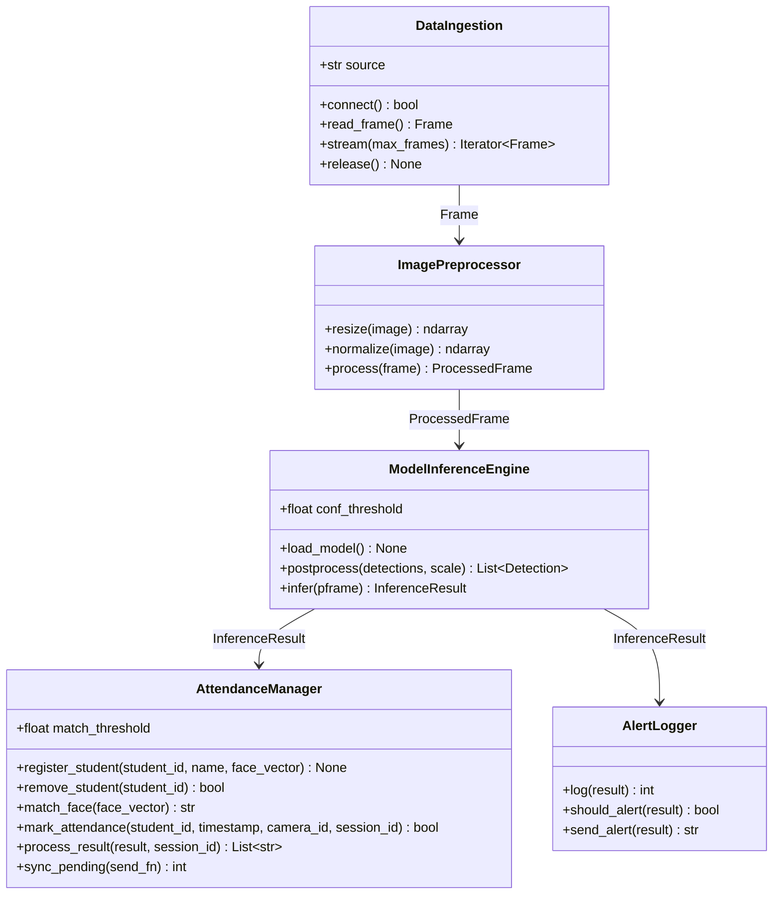

# System Design Specification

**Course:** AI Project Design and Development (AI-316)
**Lab:** 02, System Requirements and Software Architecture for AI Projects
**Project:** Smart Surveillance and Attendance System

---

## 1. Introduction

This system reads video from a camera. It finds people and objects in each frame using a trained model. It saves the results and sends an alert when an important object is found.

The same system can be used in two ways:

- **Attendance:** detect and recognise student faces and record who is present.
- **Security:** watch an area and send an alert when a person or a weapon is detected.

This document lists the requirements, the inputs and outputs, the data flow and the software modules of the system.

---

## 2. Requirements (Task 1)

### 2.1 Functional Requirements

Functional requirements describe what the system must do.

| ID | Requirement | Target |
|----|-------------|--------|
| FR-01 | The system shall detect faces in every video frame. | Detection time under 100 ms per frame |
| FR-02 | The system shall match a detected face to a registered student. | Match found within 1 second |
| FR-03 | The system shall record attendance with student ID, time and camera. | One record per student per class |
| FR-04 | The system shall send attendance records to the central database. | Records sent within 30 seconds, retried if the network is down |
| FR-05 | The system shall allow the admin to add, edit and delete student face records. | Changes active within 1 minute |

### 2.2 Non-Functional Requirements

Non-functional requirements describe how well the system must work.

| ID | Category | Requirement | Target |
|----|----------|-------------|--------|
| NFR-01 | Speed | The system shall process live video at a steady frame rate. | At least 15 frames per second |
| NFR-02 | Accuracy | The model shall reach a minimum accuracy on test data. | Face detection recall of at least 95 percent and face recognition accuracy of at least 92 percent |
| NFR-03 | Power | The edge device shall use limited power. | Average power use of 10 W or less |
| NFR-04 | Privacy | Face data shall be protected and used only for attendance. | Encrypted storage, secure network connection, raw video deleted after 7 days |
| NFR-05 | Reliability | The system shall keep working during class hours. | 99 percent uptime and automatic restart within 60 seconds after a failure |

---

## 3. System Boundary and Input/Output Specification (Task 2)

### 3.1 System Actors

| Actor | Type | Role |
|-------|------|------|
| Security Operator | Human user | Watches live alerts and checks detected events |
| Administrator | Human user | Manages cameras, settings and registered students |
| Automated Trigger System | Software | Starts or stops the system by schedule or motion |
| IP Camera | External device | Sends the video stream |
| Notification Service | External system | Delivers alerts by SMS, email or app message |

### 3.2 System Inputs

| Input | Format | Details |
|-------|--------|---------|
| Video stream | RTSP, H.264 | 1280 x 720 resolution, 15 to 30 frames per second |
| Sensor parameters | YAML config file | Camera ID, exposure, number of frames to skip |
| Detection settings | YAML config file | Confidence threshold and alert labels |
| Registration images | JPEG or PNG | At least 5 clear face images per person |
| Admin commands | HTTPS request | Start, stop and change settings |

### 3.3 System Outputs

| Output | Format | Details |
|--------|--------|---------|
| Bounding box coordinates | (x1, y1, x2, y2) in pixels | One box for each detected object |
| Label and confidence | Text and a number from 0 to 1 | Example: person, 0.91 |
| Alert notification | Text message | Contains camera ID, frame ID and label. Sent within 2 seconds |
| Log entry | CSV or database row | Frame ID, time, camera, label, confidence and box |
| Live video with boxes | MJPEG stream | Shows detections to the operator |

### 3.4 Operational Constraints

| Constraint | Limit |
|------------|-------|
| Memory use | Maximum 2 GB RAM for the whole system |
| Model size | 50 MB or less |
| Bandwidth | Maximum 4 Mbps per camera |
| Total delay | Maximum 300 ms from camera capture to alert |
| Storage | Logs kept for 30 days, raw video kept for 7 days |
| Hardware | Edge device with a small GPU or NPU. Detection must work without internet |

---

## 4. Data-Flow Diagrams (Task 3)

### 4.1 Level 0 (Context Diagram)

This diagram shows the whole system as one process. It shows only the outside entities and the data that enters and leaves the system.



### 4.2 Level 1 DFD

This diagram shows the main processes inside the system. Circles are processes. Boxes with a database shape are data stores.



---

## 5. Modular Software Architecture (Task 4)

### 5.1 Module Overview

The system is divided into five modules. Each module has one job. The output of one module is the input of the next module.

| Module | File | Responsibility | Input | Output |
|--------|------|----------------|-------|--------|
| DataIngestion | `data_ingestion.py` | Connects to the video source and provides raw frames | Source URL or file path | `Frame` |
| ImagePreprocessor | `image_preprocessor.py` | Resizes the frame, scales pixel values and arranges the channels | `Frame` | `ProcessedFrame` |
| ModelInferenceEngine | `model_inference_engine.py` | Loads the model, finds objects and removes low-confidence results | `ProcessedFrame` | `InferenceResult` |
| AttendanceManager | `attendance_manager.py` | Matches faces to registered students, records attendance once per class, sends records to the central database and manages student data | `InferenceResult` | Attendance records |
| AlertLogger | `alert_logger.py` | Saves all detections, creates alerts for watched labels and sends them through a notification service | `InferenceResult` | Log rows and sent alerts |

### 5.2 Class Diagram



### 5.3 Method Signatures

```python
class DataIngestion:
    def __init__(self, source: str, camera_id: str = "cam_01", target_fps: int = 15) -> None
    def connect(self) -> bool
    def read_frame(self) -> Optional[Frame]
    def stream(self, max_frames: Optional[int] = None) -> Iterator[Frame]
    def release(self) -> None

class ImagePreprocessor:
    def __init__(self, target_size: Tuple[int, int] = (640, 640)) -> None
    def resize(self, image: np.ndarray) -> np.ndarray
    def normalize(self, image: np.ndarray) -> np.ndarray
    def process(self, frame: Frame) -> ProcessedFrame

class ModelInferenceEngine:
    def __init__(self, model_path: str, conf_threshold: float = 0.5, iou_threshold: float = 0.45) -> None
    def load_model(self) -> None
    def postprocess(self, detections: List[Detection], scale: tuple) -> List[Detection]
    def infer(self, pframe: ProcessedFrame) -> InferenceResult

class AttendanceManager:
    def __init__(self, match_threshold: float = 0.6) -> None
    def register_student(self, student_id: str, name: str, face_vector: np.ndarray) -> None
    def remove_student(self, student_id: str) -> bool
    def match_face(self, face_vector: np.ndarray) -> Optional[str]
    def mark_attendance(self, student_id: str, timestamp: float, camera_id: str, session_id: str) -> bool
    def process_result(self, result: InferenceResult, session_id: str) -> List[str]
    def sync_pending(self, send_fn: Callable[[dict], bool]) -> int
    def pending_count(self) -> int

class AlertLogger:
    def __init__(self, log_path: str = "detections_log.csv", alert_labels: Set[str] = None, alert_confidence: float = 0.7, notifier: Optional[Callable[[str], None]] = None) -> None
    def log(self, result: InferenceResult) -> int
    def should_alert(self, result: InferenceResult) -> bool
    def send_alert(self, result: InferenceResult) -> str
```

The full Python files are in the `modules/` folder. Run `python test_modules.py` inside that folder to test all modules.

### 5.4 Shared Data Types (`types_common.py`)

| Type | Fields |
|------|--------|
| Frame | frame_id, timestamp, image, camera_id |
| ProcessedFrame | frame_id, timestamp, tensor, scale, camera_id |
| Detection | label, confidence, bbox, embedding (optional), student_id (optional) |
| InferenceResult | frame_id, timestamp, detections, latency_ms, camera_id |

---

## 6. Requirement Traceability

This table shows which module meets each requirement.

| Requirement | Module | How it is met |
|-------------|--------|---------------|
| FR-01 Face detection | ModelInferenceEngine | Runs the model and returns face boxes |
| FR-02 Face matching | AttendanceManager | `match_face()` compares a face to registered students |
| FR-03 Attendance records | AttendanceManager | `mark_attendance()` allows one record per student per class |
| FR-04 Send records to database | AttendanceManager | `sync_pending()` sends records and keeps failed ones for retry |
| FR-05 Admin student management | AttendanceManager | `register_student()` and `remove_student()` |
| NFR-01 Frame rate | DataIngestion and ImagePreprocessor | Frame skipping and fast resizing |
| NFR-02 Accuracy | ModelInferenceEngine and AttendanceManager | Confidence threshold and match threshold |
| NFR-03 Power | Deployment on the edge device | Small model, limited frame rate, no cloud processing |
| NFR-04 Privacy | AttendanceManager and AlertLogger | Only attendance data is stored. Storage and network security are set in deployment |
| NFR-05 Reliability | `pipeline.py` and AttendanceManager | The pipeline is restarted automatically after a failure. Unsent records are kept and retried |

---

## 7. Verification Plan

Each target in Section 2 will be checked in the following way.

| Requirement | Test method | Pass condition |
|-------------|-------------|----------------|
| FR-01, NFR-01 | Run the pipeline on a 5-minute test video and record the time per frame | Under 100 ms per frame and at least 15 FPS |
| NFR-02 | Run the model on a labelled test set | Recall at least 95 percent, recognition accuracy at least 92 percent |
| FR-02, FR-03 | Unit tests in `test_modules.py` | Correct student matched and no duplicate records |
| FR-04 | Unit test with a failing and a working send function | Failed records are kept and sent later |
| NFR-03 | Measure power use on the device for 1 hour | Average 10 W or less |
| NFR-04 | Check storage and network settings | Data encrypted and raw video deleted after 7 days |
| NFR-05 | Run for one full class day and stop the process on purpose | 99 percent uptime and restart within 60 seconds |
| Constraints (memory, bandwidth, delay) | Monitor the running system | Within the limits in Section 3.4 |

---

## 8. Implementation Status

This lab is about design. The Python files in `modules/` are working skeletons that show the structure and the data passed between modules.

| Part | Status |
|------|--------|
| Module structure, method names and data types | Complete and tested |
| Frame resizing, scaling and channel arrangement | Complete and tested |
| Face matching, attendance records, duplicate check and retry of failed sends | Complete and tested |
| Model loading and prediction | Placeholder. The real model (ONNX, PyTorch or TFLite) will be added in the project phase |
| Video capture from a real camera | Placeholder. OpenCV will be added in the project phase |
| Alert delivery | A notification function is passed to `AlertLogger`. The real SMS or email service will be added in the project phase |
| Central database connection | A send function is passed to `sync_pending()`. The real database connection will be added in the project phase |

---

## 9. Conclusion

The system is divided into five modules that share clear data types. The requirements, inputs and outputs, data flow, class design and traceability table match each other. Each module can be built and tested separately.
